# 上海交通大学-自动化-816自动控制原理-小齐学长-上交自动化26考研初试复试备考经验分享公益讲座27考研28考研备考规划公开课 - 教学笔记 (精炼版)

---

## Slide 1 (时间点: 00:00:02)

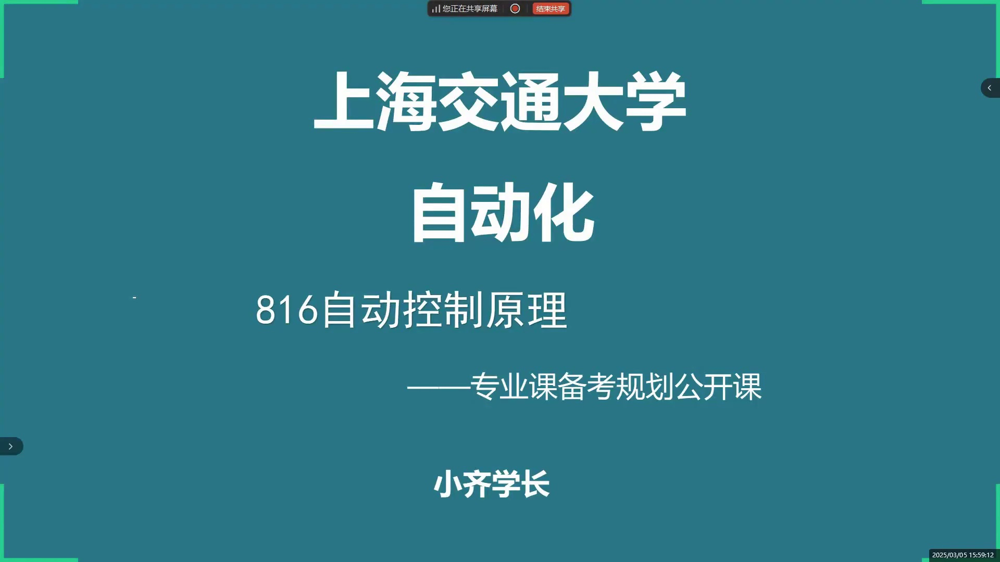

> 上海交通大学的小齐学长，欢迎来到上海交通大学自动化816自动控制原理专业课备考规划公开课。我是今天的

---

## Slide 2 (时间点: 00:00:14)

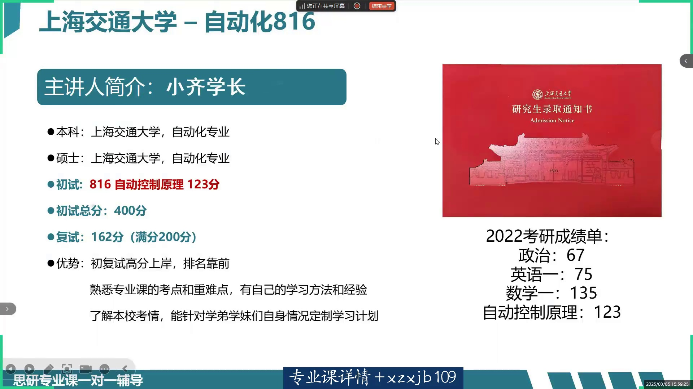

> 主讲人小齐学长。首先，我进行自我介绍，大家可以叫我小齐学长。我本科和硕士均就读于上海交通大学自动化系，于2022年参加考研。考研成绩单如下：政治67分，英语175分，数学135分，自动控制原理123分。上面是我的研究生录取通知书。我初试是816，专业课是自动控制原理，分数123分；初试总分为400分，复试162分，满分200分。我的一个优势是初复试高分上岸，排名靠前，熟悉专业课的考点和重难点，有自己的学习方法和经验，了解本校考情，能够针对学弟学妹们自身情

---

## Slide 3 (时间点: 00:00:59)

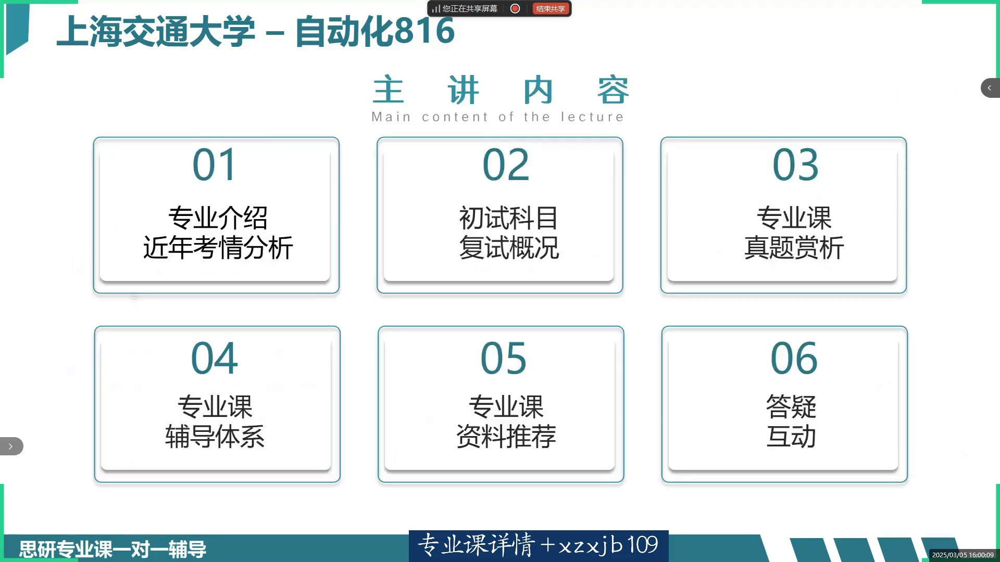

> 况，定制学习计划。
> 
> 接下来，我将从以下六个方面展开本次公

---

## Slide 4 (时间点: 00:01:04)

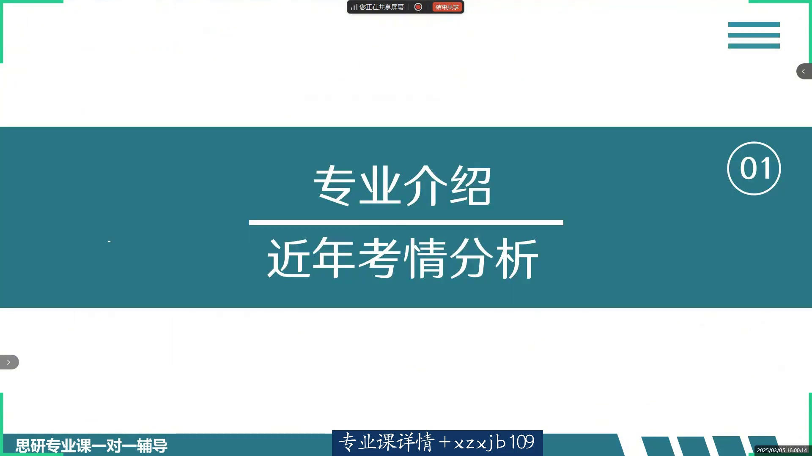

> 开课：首先是专业介绍及近

---

## Slide 5 (时间点: 00:01:07)

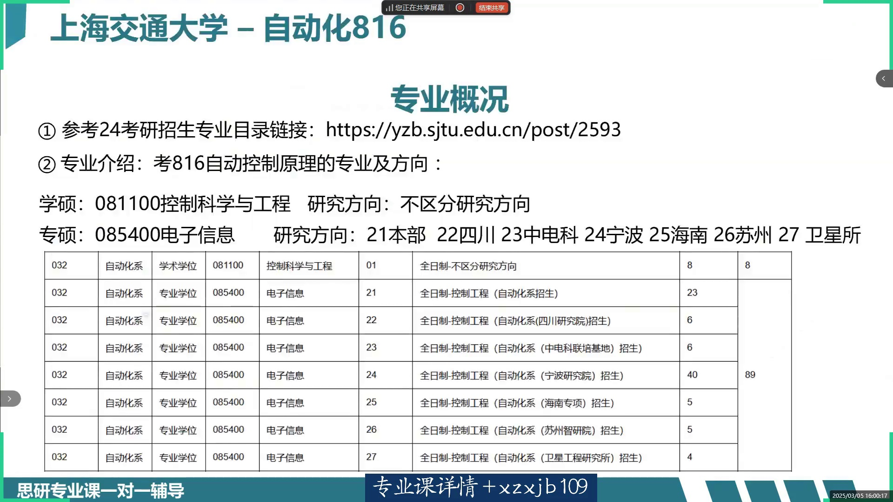

> 年的考情分析；其次是专业概况；第三是近年招生情况及分数线；第四是初试科目；第五是专业课内容分析；第六是专业课辅导体系及资料推荐。
> 
> 首先，专业概况可参考2024年考研招生目录。专业介绍：考816自动控制原理的专业及方向主要有学术型，代码为081100，控制科学与工程，研究方向为智能控制；专硕085400电子信息，研究方向分别为本部专硕以及联培专硕。联培专硕包括四川联培、中电科联培、宁波联培、海南联培、苏州联培以及威海联培。
> 
> 下面为2024年考研招生目

---

## Slide 6 (时间点: 00:01:44)

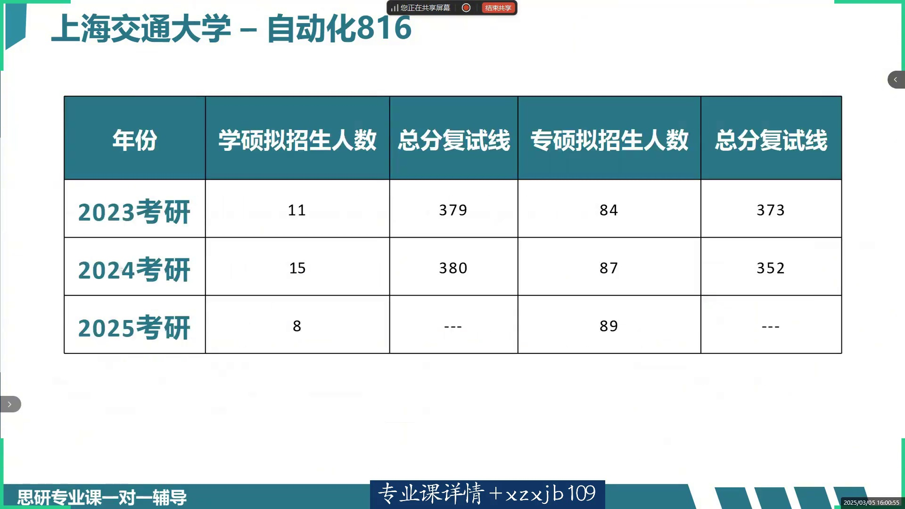

> 录。近几年人数及分数线情况如下：2023年考研，学术招11人，录取分数线379；专硕招84人，录取分数线373。2024年考研，学术招15人，录取分数线388；专硕招87人，录取分数线352。今年，学术招82人，专硕招89人，录取分数线尚未公布。可以看出，学术招生基本呈减少趋势，专硕招生越来越多，但本部招生名额总体上呈现增长趋势。其实专硕名额扩增主要来自联培硕士的

---

## Slide 7 (时间点: 00:02:28)

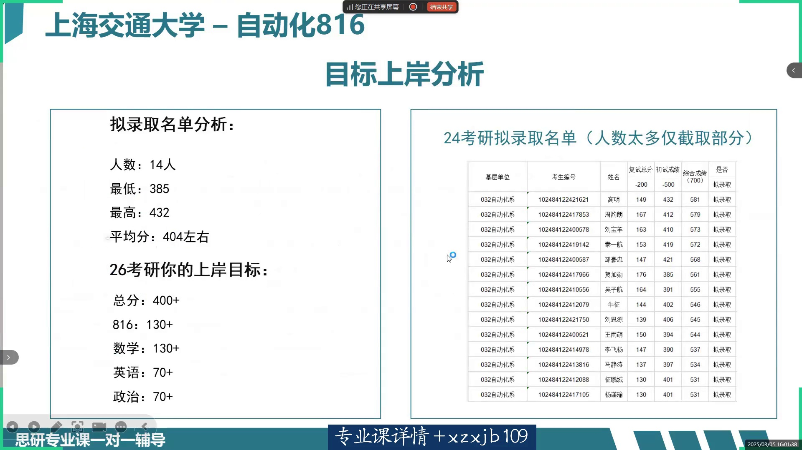

> 扩增。
> 
> 根据2024年考研录取名单，我们选取了部分录取名单进行分析。录取人数为14人，最低分385分，最高分432分，平均分约404分。如果你2026年考研想上岸，目标总分需达到400分以上。其中，816自动控制原理130分，数学130分，英语和政治均70分即

---

## Slide 8 (时间点: 00:02:58)

> 可。
> 
> 接下

---

## Slide 9 (时间点: 00:03:01)

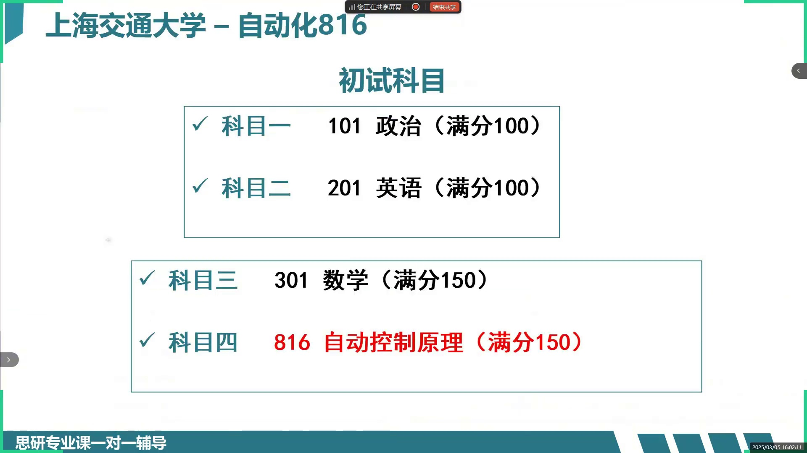

> 来，讲解初试科目。初试科目包括：科目一为政治，科目二为英语，均为公共课，满分各100分；科目三为数学，满分150分，考数一；科目四为专业课816自动控制原理，满分150分。
> 
> 专业课试题结构：816自动控制原理大多数年份为8道大题，少部分年份有简答题和填空题。复试形式为笔试加面试，具体安排见去年复试通知书。复试在东向院及程瑞球楼进行，笔试可使用非智能计算器，笔试面试分组需到现场查看。复试内容及成绩计算方法：复试包括专业测试和综合面试，满分200分。专业测试100分，以笔试为主，由各学院组织；对于自动化学院，无上机考，主要为笔试，考控制原理及嵌入式基础知识。综合面试100分，包括外语口语和听力、专业能力、科研创新能力和发展潜力。在复试中，相比专业测试，面试对老师的影响更大，若面试表现出色，复试成绩不会差。复试虽包括专业测试和综合面试，但可在一

---

## Slide 10 (时间点: 00:04:25)

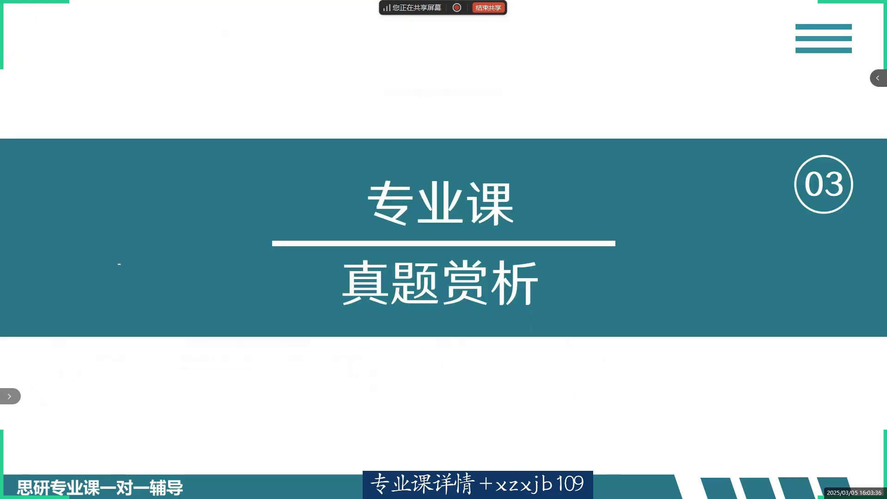

> 天内完成。
> 
> 接下来，进行

---

## Slide 11 (时间点: 00:04:28)

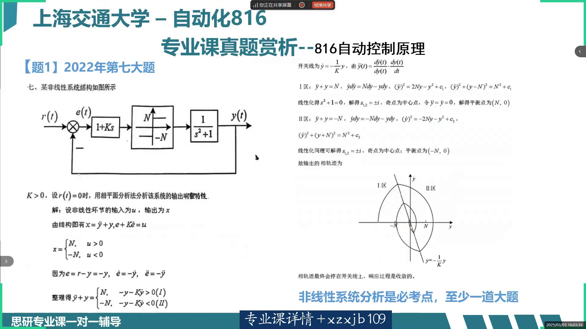

> 专业课整体分析。以2022年第七道大题非线性系统分析为例。某非线性系统的结构如图所示，要求用相平面分析法分析该系统的输出响应特性。这道题是典型的利用相平面分析法分析非线性系统输出响应特性的题目。针对非线性系统，816自动控制原理考察重点。816自动控制原理包括8道大题，其中6道大题源于自动控制原理，一道大题是非线性系统，另一道大题是现代控制系统分析，由三部分组成。
> 
> 对于本题，这是一道简单的利用相平面分析法解答的非线性环节问题，输入为U，输出为X。对于结构图，可得X等于Y加U，Y等于K1U。代入整理后，得到X等于K1U加U。其中，非线性特点为：若U大于0，则X等于N；若U小于0，则X等于负N。将U代换并整理，可得E加U等于N（当E大于0时），E加U等于负N（当E小于0时）。由此，系统可分为两个区域。开关线指两区的分界线，求解得开关线为E等于负K分之一。划分区域后，针对I区（E加U等于N），将其线性化为S方加E等于0，解得两根为正负I，起点为中心点，令E等于0得平衡点为(N,0)。针对II区进行同样稳定性分析，得两根为正负I，起点为中心点，平衡点为(-N,0)。结合平衡点，可得输出相轨迹如图所示。观察到相轨迹最终收敛在开关线上，整个相图过程收敛。这就是非线性系统分析的基本过程：首先将方框图转化为分段方程，求取开关线获得不同区域分析；然后对每个区域进行起点、平衡点分析；完成后，根据所学知识进行相轨迹判断，画出相轨迹后即可判断是否收敛。对于非线性系统分析，考察知识点不多，相平面分析法是最重要的考点，希望大家好好掌握。若考试中考到此大题，应尽可能拿满分

---

## Slide 12 (时间点: 00:07:50)

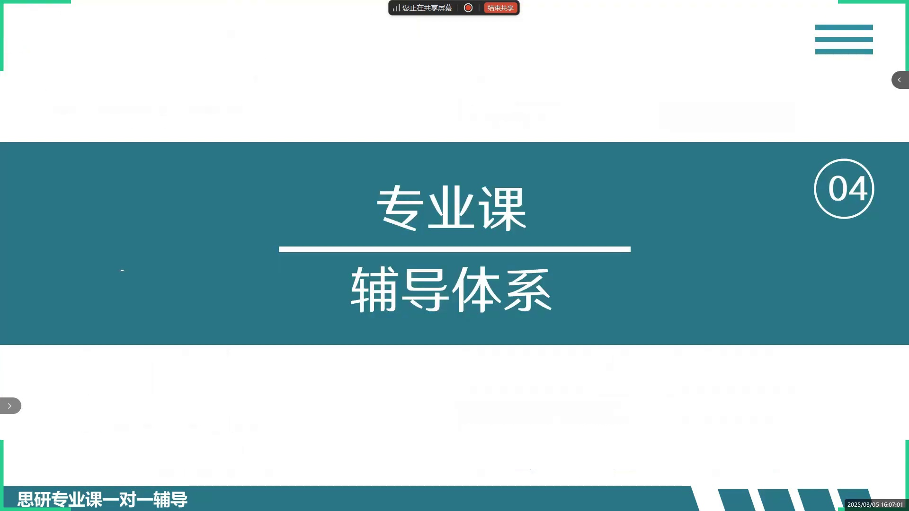

> 。
> 
> 接下来，介绍专业课辅导体系。我

---

## Slide 13 (时间点: 00:07:53)

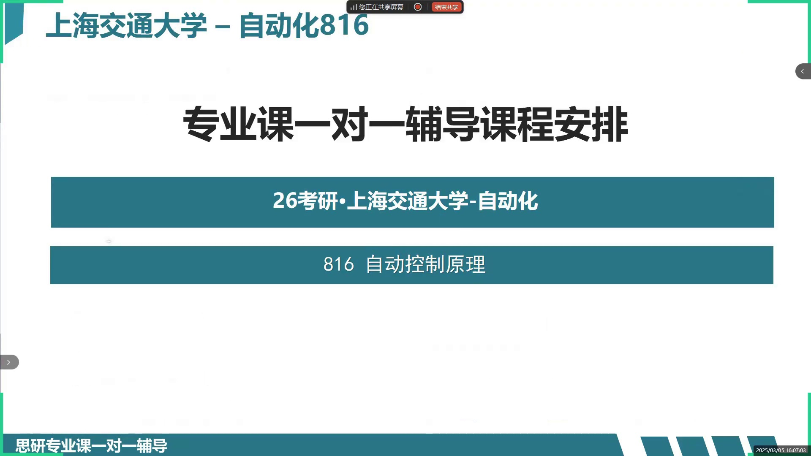

> 们专业课A对E

---

## Slide 14 (时间点: 00:07:57)

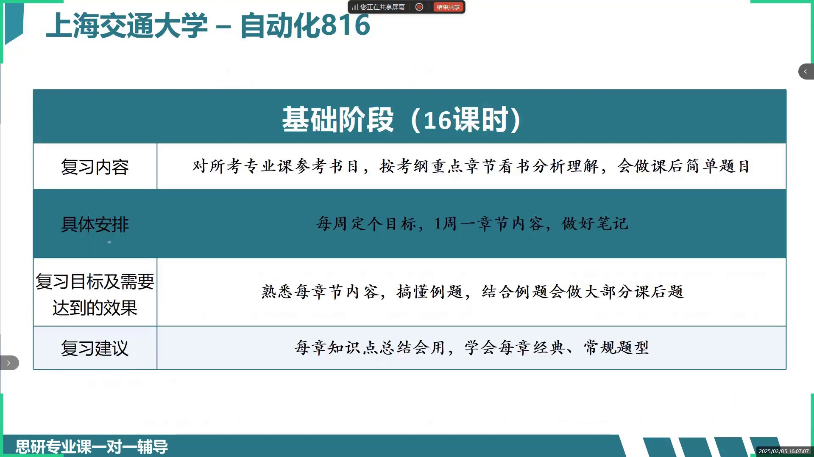

> 辅导课程安排

---

## Slide 15 (时间点: 00:08:00)

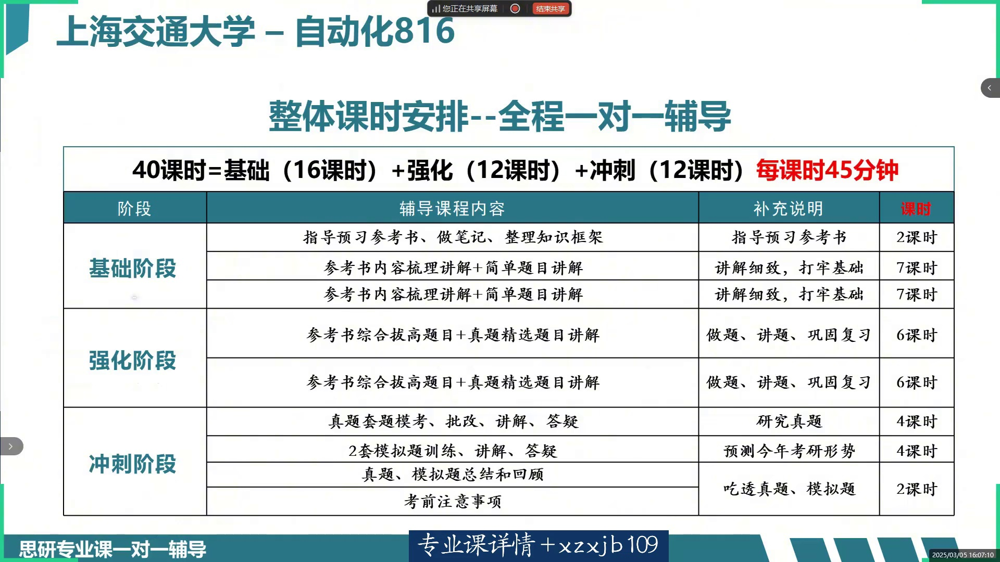

> 包括40个课时，分为基础、强化和冲刺阶段，每节课45分钟。基础阶段16个课时，强化阶段12个课时，冲刺阶段12

---

## Slide 16 (时间点: 00:08:15)

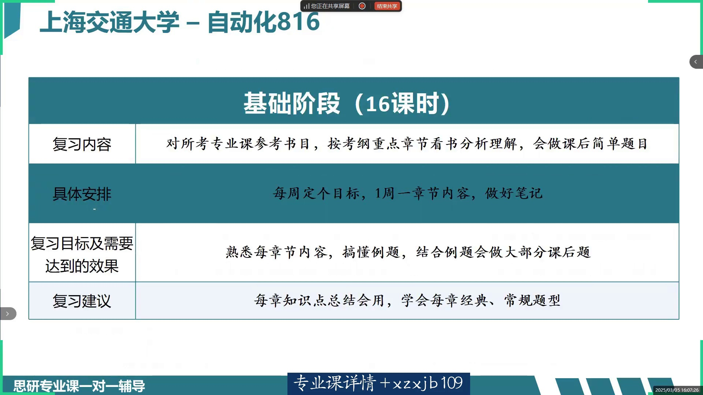

> 个课时。
> 
> 首先，基础阶段：复习内容为对所有所考专业课参考书目，按考纲重点章节看书、分析、理解、会做课后简单题目。具体安排：每周设定目标，一周一章节内容，做好笔记。复习目标及效果：熟悉每章节内容，搞懂例题，结合例题会做大部分课后题。复习建议：每章知识点总结，会用、学会每章经典常规题型。基础阶段花费大量时间的原因是：在基础阶段对参考课本及考纲重点章节进行充分分析，构建自己的知识体系，后续复习才能更有针对性、更高效。
> 
> 其次，强化阶段：12个课时。复习内容为会做书中拔高和难题及对应精选题目，同时完整过一遍书上的知识点和简单题目。具体安排：各章节习题交替练习，防止遗忘，自己单独完成绝大多数题目，并钉证总结。复习目标：课后所有习题可独立完成，书上知识点熟练掌握。复习建议：对遗忘的知识点和题型多加复习，保证复习量。在强化阶段，要在基础阶段构建的体系上不断夯实积累，让从书本中学到的知识真正变成自己的知识，构建自己的知识体系架构，才能在考试中快速提取所需知识点和信息，短时间内又快又对地完成考试，最终取得不错分数。
> 
> 最后，冲刺阶段：在11月、12月份左右，12个课时。复习内容为近年整套模拟训练、讲解答疑、重复二轮做过的题目，结合真题和模拟题，争取高分。具体安排：巩固强化记忆内容，查看知识体系，无遗漏知识点和题目，重复自己常做的内容。复习目标：知识点数量掌握，各种题目解题思路明确，解题步骤全面规范。规范在考试中非常重要。复习建议：坚持做题，做到全面精通。冲刺阶段主要进行整套模拟训练，不断模考使你在考试中发挥水平，体验出题人（学校老师）的出题思路，考试中不紧张、不害怕，将真正所学发挥出来，从而取得不

---

## Slide 17 (时间点: 00:11:06)

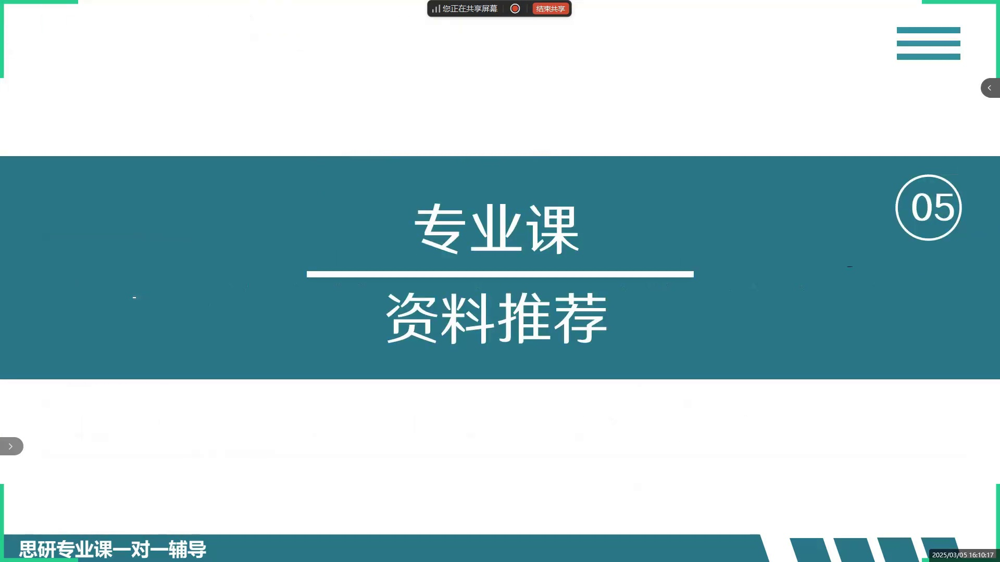

> 错成绩。
> 
> 下面推

---

## Slide 18 (时间点: 00:11:09)

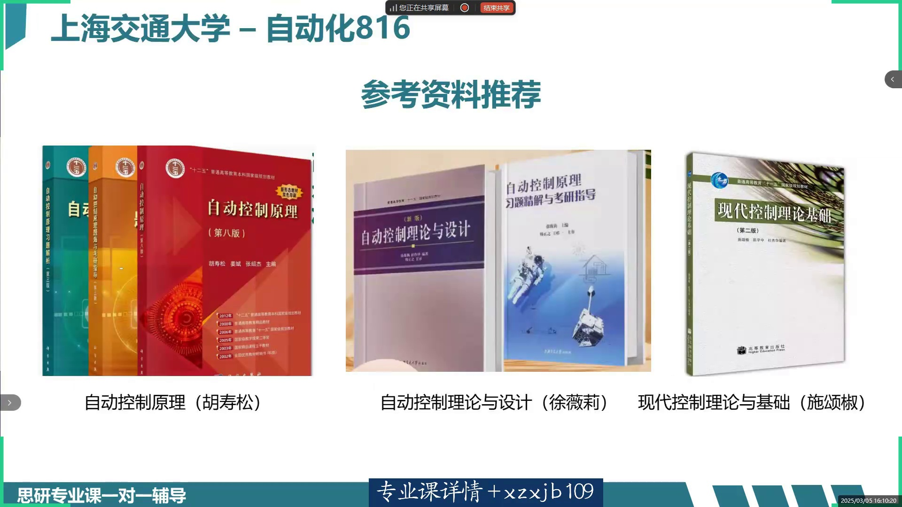

> 荐专业课资料。首先，胡寿松老师的《自动控制原理》第八版，讲解全面，包含自动控制原理基本内容、非线性系统分析及现代控制理论分析。其次，胡寿松老师的《自动控制理论与设计》及《现代控制理论》，这两本书是我本科期间上课老师使用的参考教材，因初试人即上课老师，出题依据教材，故非常重要

---

## Slide 19 (时间点: 00:11:47)

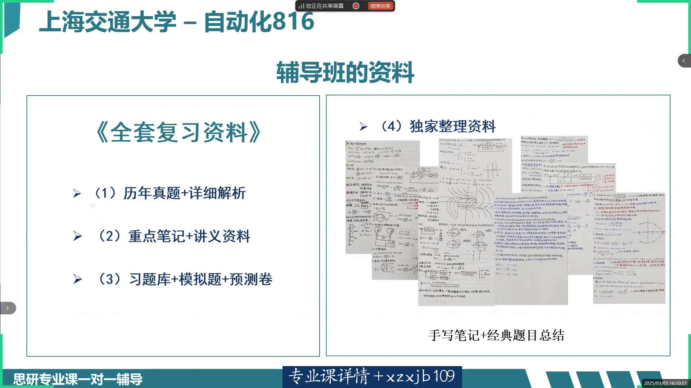

> 。
> 
> 胡寿松课程资料包括：全套复习资料（历年真题加详细解析、重点笔记加讲义、习题库、模拟题、预测卷）及独家整理资料。独家资料为我考研时根据网上资料整理的熟悉笔记、经典题目总结及错题感悟。若参加胡寿松课程，这些资料将提供给你，让你站在我的肩膀上，基于我的学习经验继续学习，从而在更短时间内取得不错分数。站在前人的肩膀上前进，总比自己摸索前进更努力、更容易、更

---

## Slide 20 (时间点: 00:12:34)

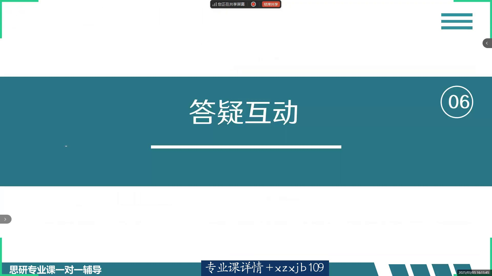

> 便捷。
> 
> 最后是答疑互

---

## Slide 21 (时间点: 00:12:37)

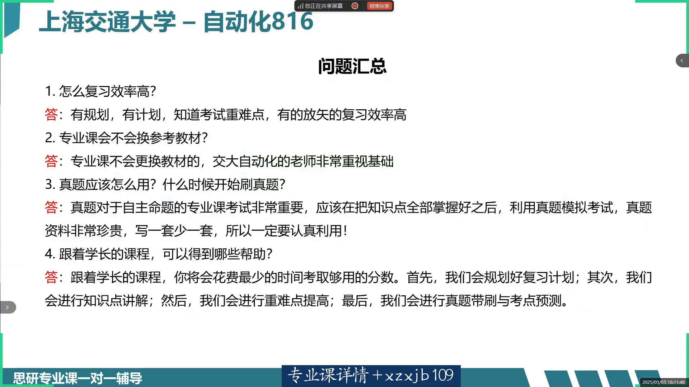

> 动。第一个问题：如何提高复习效率？回答：有规划、有计划，针对考试重难点，有目的地复习，效率更高。若像无头苍蝇到处乱飞，虽花更多时间，但未聚焦重点知识和常考知识点，复习效率会低。
> 
> 第二个问题：专业课会不会换参考教材？回答：专业课不会换教材。胡寿松老师非常重视基础，对于控制科学专业，自动控制原理、非线性系统分析、现代控制理论是基础中的基础。若控制专业学生连这些基础都不会，便不能成为合格的控制专业学生。
> 
> 第三个问题：整套模拟题应何时用、如何用？回答：整套模拟题对专业课考试非常重要，应在知识点全部掌握后，利用模拟题进行模拟考试。模拟题资料非常珍贵，少做一道少一道，大家务必认真利用。
> 
> 跟着学长的课程，你能得到哪些帮助？首先，我们会规划好学习计划；其次，进行知识点讲解；然后，进行重点提升；最后，进行整套模拟训练与考点预测。跟着学长一定没问题，你会在最短时间内考取足够分数。
> 
> 分析结束，感谢大家观看。希望大家都能取得美好成绩，考上自己心仪的研究生。到此结束，谢谢。

---

