# 计算机公开课实用Python程序设计200讲北京大学_p09_211_算术运算 - 教学笔记 (精炼版)

---

## Slide 1 (时间点: 00:00:02)

> 变天下都不怕。欢迎来到Python的世界。接下来我们要讲

---

## Slide 2 (时间点: 00:00:07)

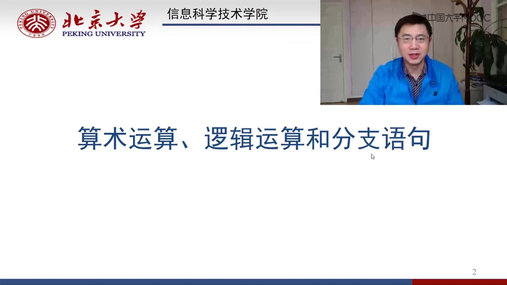

> 的是Python里面的算术运算、逻辑运算和分支运算。非常有用

---

## Slide 3 (时间点: 00:00:15)

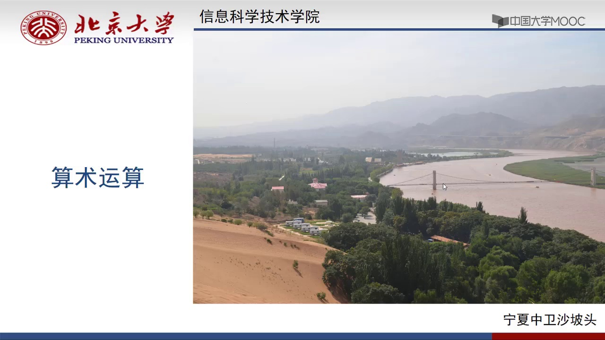

> 。我们先说算术运算。算术运算顾名思义，听起来很简单

---

## Slide 4 (时间点: 00:00:21)

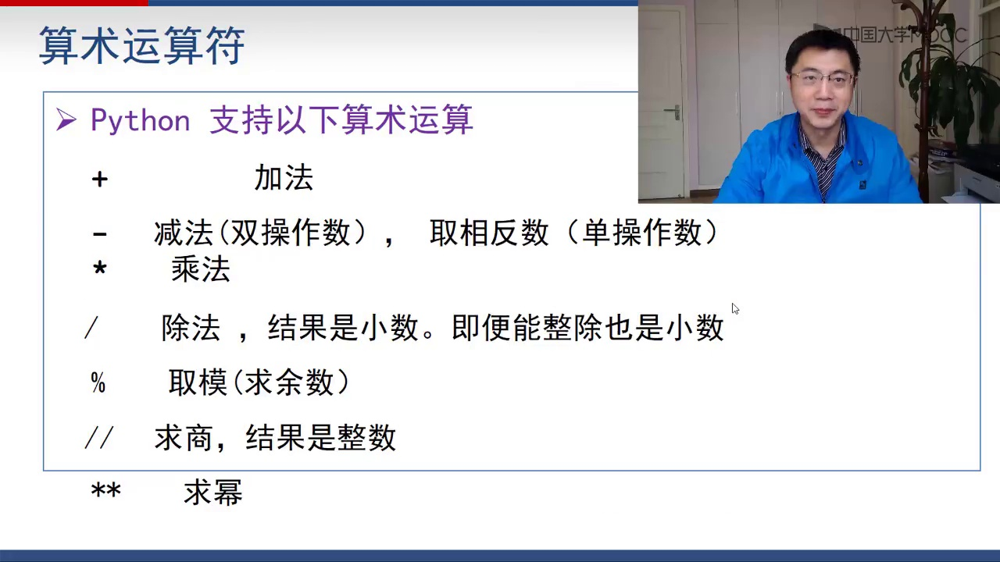

> 。无非就是加减乘除这类。意义确实如此。一门程序设计语言当然应该支持加减乘除这样的东西。那Python支持哪些算术运算呢？有加号，它支持加法；减号，当然就是减法。但这个减号在Python里面有两种含义：一种是做减法，另外一个是取相反数。做减法自然就有两个操作数，取相反数当然就只有一个操作数。那Python里面就用乘号来

---

## Slide 5 (时间点: 00:00:51)

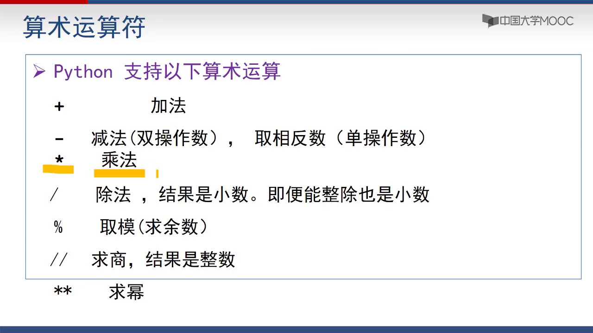

> 代表乘法。乘号就是代表乘法

---

## Slide 6 (时间点: 00:00:54)

> 。然后Python还支持除法。这个除法是用斜杠来表示的。注意这个除法算出来的结果一定是小数。它一定是小数，哪怕能整除，算出来也是小数而不是整数。Python还支持用百分号做取模。取模就是求一个数除以另外一个数的余数。双斜杠的这种除法，它就是求整数除法，也就是说，求出来的结果一定是整数，它只是求不整除的部分就去掉不要了。那还有两个斜杠写在一起叫做

---

## Slide 7 (时间点: 00:01:29)

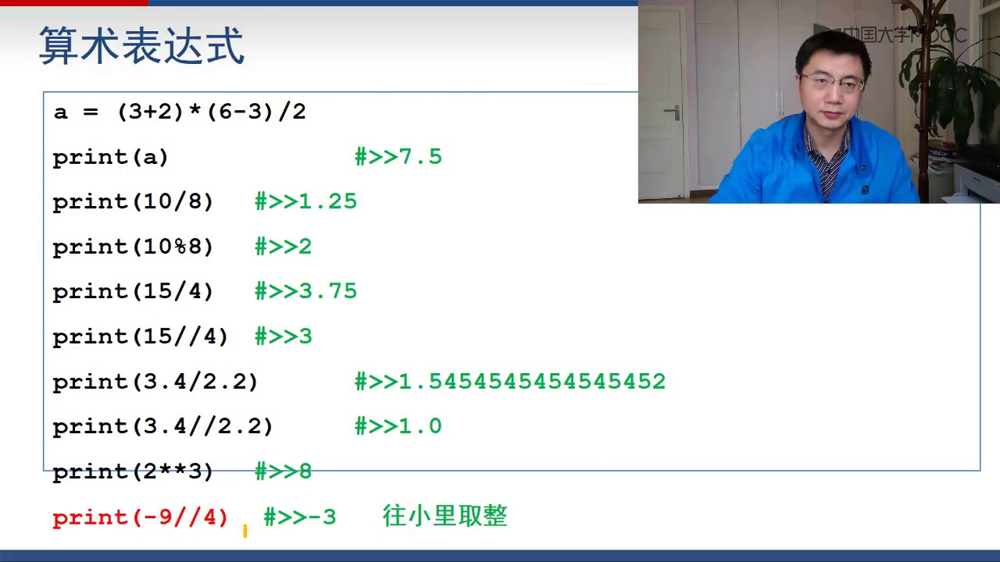

> 整除。我们来看一下具体的例子。
> 
> 接下来要说的就是算术表达式。前面那些加减乘除算术运算，有了算术运算，我们就可以写算术表达式。比如说a等于3加2乘以6减3除以2。这个含义很清楚。乘号代表乘，除号代表除。注意这个除的结果一定是小数。那你print a打出来就是7.5。3加2得5，乘以3等于15，再除以2就7.5。然后print a 10除以8，10除以8就是1.25。print a 10 % 8，10 % 8得2，因为10除以8的余数是2。那15除以4得到了结果自然就3.75。print a 15 // 4，两个除号4的意思就是说要除出来的结果只是3的部分，余数直接去掉了。15除以4，它的整数部分自然是3，余数是3，去掉不要了。然后再看这个3.4除以2.2，这个除法算出来是1.545。保留小数点后面多少位，你不用管，打出来是多少位就是多少位。如果你想要控制它打出来，比如说一定要打出来是小数点后面两位保留两位，或者小数点后面保留三位，我们后面会讲到有格式控制来让你做这件事情。
> 
> 接下来我们看这个3.4双斜杠除法除以2.2。这个双斜杠，我们说它除出来的结果一定是取整，就是除不进的部分去掉。这个3.4除以2.2，就看3.4里面有几个2.2。3.4里面只有一个2.2，多的部分不到2.2，那我们算出来结果就应该是1。但是由于这个表达式里面有小数，那算出来结果就应该是1.0而不是整数1。记住，在Python里面，你的一个算术运算表达式里面，只要有一个操作数是小数，那整个算出来结果就是小数。那现在你这边3.4和2.2都小数，结果自然也是小数，就是1.0而不是1。
> 
> 那下面这个是2的3次方，就是8。然后这边有一个9 // 4，是取整的这个除法。两个双斜杠的除法，我们称之为取整的除法。那这个9 // 4，你到底算出来应该是2还是3？Python算出来结果是3，就说它是往小里面取整的。整个取整的方向就是往数轴的负数那个方向，往小的方向去取整。
> 
> 那么我们要强调一点：这个除法，单个的除法（单斜杠的除法）计算的结果都是小数，哪怕能整除，算出来结果也是小数。比如说你让a等于10 / 2，这个是能整除的，算下来看起来应该是5，但你把a打出来，发现是一个小数5.0。这个单斜杠的除法算下来结果一定是小数。
> 
> 然后在Python里面，-x就相当于0减x。这个很好理解。那比如说a等于10，那么print(-a)就是-10。然后print(-a * 3)呢，那就是-30。它等价于(-a) * 3。然后这个3 + (-x)也是能解释得通的。就算你看到的这就是3 + (-x)，那当然就是-2。这个负号在Python里面也是一个专门的运算，负号就叫做取相反数。
> 
> 再强调一点：有小数参与的算术表达式，结果一定是小数，哪怕结果是2，那它算出来也应该是2.0而不是整数。好比方说a等于10.0减10，你print(a)算出来就是0.0而不是整数0。然后a等于7.5减2.5，你看算出来结果好像应该是5，那你打出来是5.0。这个很重要。为什么？因为我们以后在做作业的时候，题目里面比如说要求输出整数，上面的题目会说要求打出来的结果是个整数。那你打出来，没有注意到这事的话，随便print一个结果可能就是个小数，那就不对了。他要求的输出结果是5，你打出5.0，那是错的。虽然你认为5和5.0是相同的，但是如果题目要求你打出5，你打出5.0，那你就错了。
> 
> 接着看这个

---

## Slide 8 (时间点: 00:05:49)

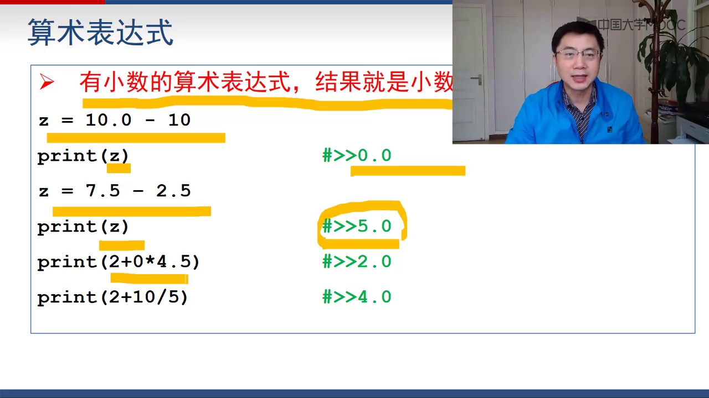

> 2加上1乘以4.5，那算出来就是2.0。只要有小数参加的表达式，算出来结果就是小数。那现在2加上10 / 5，注意是2.0，对不对？那现在就变成有小数参加了。然后你2加上2.0，结果就是4.0。那注意有时候题目会要求你打出整数，哪怕结果是整数。如果这个时候你打出一个小数，那你就是错

---

## Slide 9 (时间点: 00:06:20)

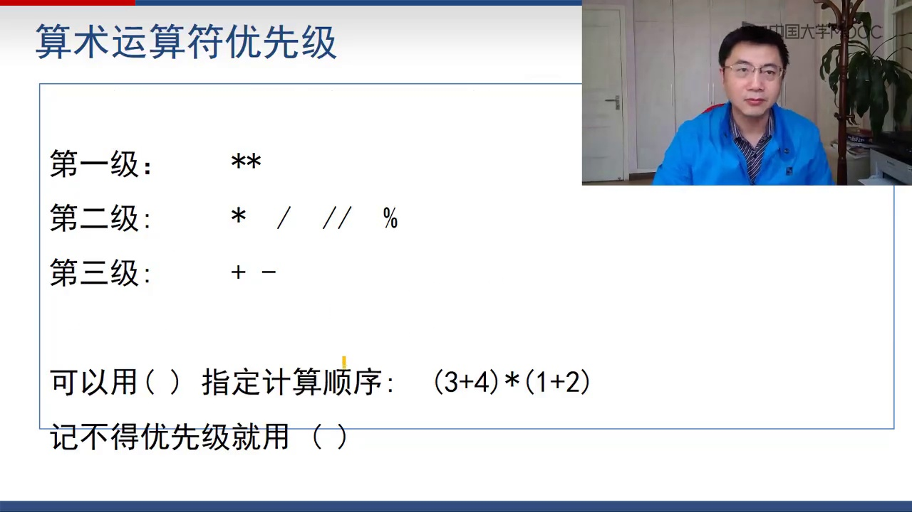

> 的。
> 
> Python的算术运算符是有优先级的。这优先级基本上跟我们小学算术是一样的。最高优先级的就是乘方。然后第二级就是乘除法还有取模。第三优先级的就是加减。这个跟算术运算是相同的。然后我们在Python的算术表达式里面，同样可以用括号来指定计算顺序。3加4乘以1加2是什么意思？都明白。如果你记不得这些运算符的优先级，你就多用括号就好了

---

## Slide 10 (时间点: 00:06:54)

> 。
> 
> 然后我们再看一下算术运算的同时进行赋值。Python里面有一些赋值运算符，就是加等于、减等于、乘等于、除等于这些东西怎么用。很好理解。a += b，它是什么？它就等价于a = a + b。说的就是把b加到a上去。所以这个a += 就等价于a = a + b。a -= b，它就等价于a = a - b。除等于、模等于这些都一样。我就不再重复解释了，相信大家肯定能够明白。
> 
> 那我们再看具体的例子。比如说a = a / 3，那是什么？就是a等于a除以3。那算出来就是2.0。除法这个单斜杠的除法算出来的结果一定是个小数。a *= 3，这个乘等于实际上说的就是乘方，那就是a的3次方。就a等于a的3次方。那不就是8吗？你前面a是2.0了，所以这个时候再算3次方，算出来还是一个小数，就是8.0

---

## Slide 11 (时间点: 00:07:56)

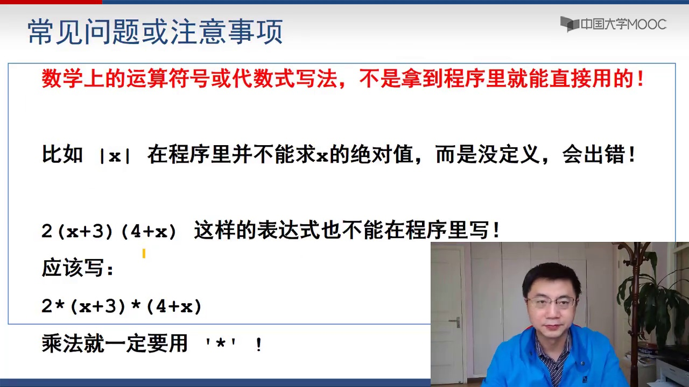

> 。
> 
> 然后我们再说一下除法运算常见的问题或者注意事项。这个问题看来挺可笑的，但是我在教学过程中确实发现有些学生就会犯这样的错误。我们要注意的就是，数学上的运算符号或者代数式子的写法，不是能够拿到程序里就直接使用的。比方说你在数学上可以写| x | 就代表x的绝对值。当你在程序里面写| x | 再加一个| | 写成这样的东西，那它没有任何意义，它不能求x绝对值。在Python里面是没有定义的，会出错。你不要想当然了，就把数学上的写法用到程序里面，觉得这就ok。不是这样的。Python有它自己的一套规则。比方说我看到有些同学在它的程序里面写2*(x+3)*4+x，这是一个标准的代数式子。这个写在一块就是2乘以(x+3)再乘以(4+x)。但是在Python里面，你不能这么写。Python里面你要写成2*(x+3)*(4+x)，必须要用乘号。上面这个式子在Python里面写出来就应该是2*(x+3)*(4+x)。必须要用乘号。总而言之，你不要想当然了，把数学表达式的写法直接拿到Python里面，这个是不行的

---

## Slide 12 (时间点: 00:09:11)

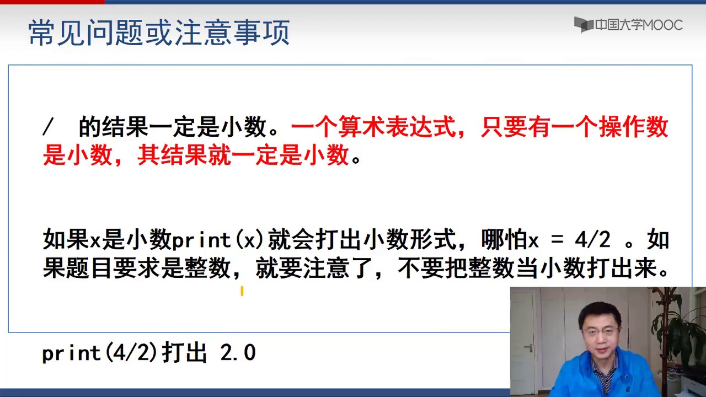

> 。
> 
> 还有再强调一点，怎么强调都不过分：这个除法，单个的除法（单斜杠）计算的结果一定是小数。还有一个算术表达式，只要有一个操作数是小数，其结果就一定是小数。这是初学者很容易犯的问题。就是我刚才说不止一遍了。重要的事情我要说三遍：说三遍就是因为有些题目要求你输出的结果是整数。结果有些同学写的程序，输出的结果从数学上来讲是对的，比如题目要输出一个5，结果他输出的是5.0。从数学上来讲也没错，但是从程序设计的角度来讲，你就是错的。因为题目要求你输出一个整数，你就不能输出一个小数。
> 
> 好，那么如果x是小数的话，那么print(x)就会打出小数的形式。哪怕你x等于4/2，那x就是2.0，print(x)就是2.0。那题目要求是整数输出，你就一定要打出整数，你不能把它把整数当作小数打出来。
> 
> 那好了，那你就会问了，那我得到的结果就是一个小数，你让我把它当成整数打出来，你怎么办？那倒也挺好办的，你就可以来个int。就说如果x是个小数，那你直接int(x)就能把它转成一个整数了。但这个转换呢，前面提到过，int(x)这个转换它是去尾取整，就是2.5、2.9全部都变成2。那2.0自然也就变成2。所以可以用这种办法把小数变成一个整

---

## Slide 13 (时间点: 00:10:43)

> 数。
> 
> 那再说一个初学者很容易犯的错误：除号它是算术里面这个除号，它不是

---

## Slide 14 (时间点: 00:10:53)

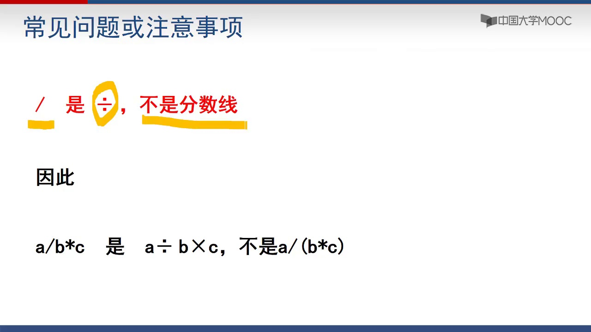

> 分数线。所以A除以B乘以C实际上它是A除以B乘以C，不是A除以(B乘以C)。这边

---

## Slide 15 (时间点: 00:11:01)

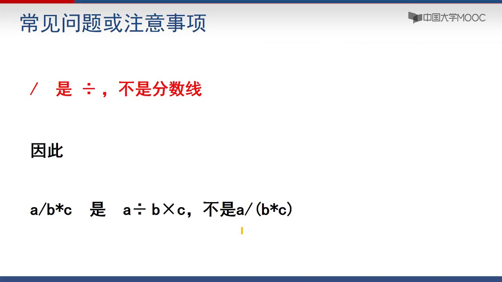

> 写的各种常见问题或者注意事项都是这些。很多初学者的血泪教训。要注意别人的前车之

---

## Slide 16 (时间点: 00:11:11)

> 鉴。
> 
> 好，那现在我们来考一考大家。做一道选择题：print(4 + 6 / 1)的结果是什么？结果是7.0。为什么是7.0？6 / 1哪怕能整除，除法的结果一定是小数，那就是3.0。4 + 3.0，只要有小数参加的运算，结果一定是小数，所以结果就7.0。

---

