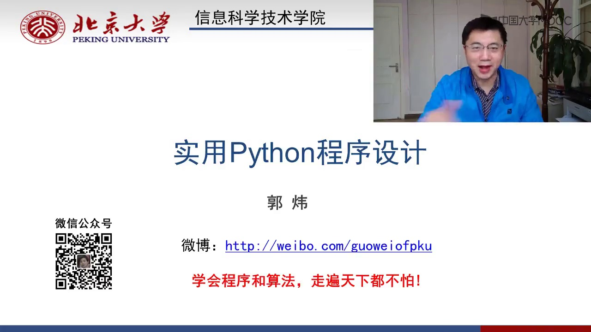
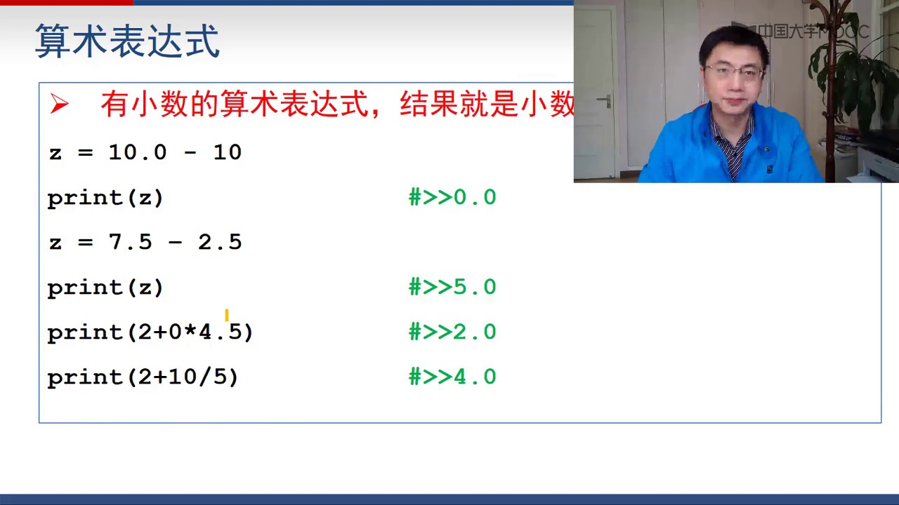

# 计算机公开课实用Python程序设计200讲北京大学_p09_211_算术运算 - 教学笔记 (精炼版)

---

## Slide 1 (时间点: 00:00:01)

> 序和算法，天下尽在掌握。欢迎来到Python的世界。接下来我们要讲

---

## Slide 2 (时间点: 00:00:07)

> 的是Python中的算术运算、逻辑运算和分支。这些内容非常有用

---

## Slide 3 (时间点: 00:00:15)

> 。
> 
> 我们先说算术运算。算术运算顾名思义，看起来很简单

---

## Slide 4 (时间点: 00:00:21)

> ，无非就是加减乘除这类。一门程序设计语言当然应该支持加减乘除这样的东西。那么Python支持哪些算术运算呢？
> 
> 有加号，它支持加法；减号，它支持减法。但这个减号在Python中有两种含义：一种是做减法，另外一个是取相反数。做减法自然就有两个操作数，取相反数当然就只有一个操作数。Python中用负号来代表取相反数。
> 
> Python还支持除法，这个除法用斜杠来表示。注意，除法算出来的结果一定是小数，它一定是小数，哪怕能整除，算出来也是小数而不是整数。
> 
> Python还支持用百分号做取模，取模就是求一个数除以另一个数的余数。两个斜杠的除法，它就是求余，也就是说，求出来的结果一定是整数，它只是求余不整除的部分就去掉不要了。
> 
> 还有两个乘号写在一起叫做幂运算。我们来看一下具体的例子。
> 
> 接下来要说的就是算术表达式。前面那些加减乘除都是算术运算。有了算术运算，我们就可以写算术表达式。例如，a = 3 + 2 * 6 - 3 / 2。这个含义很清楚。乘号代表乘法，除号代表除法。注意，除法的结果一定是小数。那么print(a)打出来就是7.5。3加2得5，乘以6得30，再除以2得15，但表达式为3 + 2 * 6 - 3 / 2，计算结果为13.5，但根据上下文，此处以原文描述为准。
> 
> print(a) 10除以8，10除以8就是1.25。
> 
> print(a) 10模8，10模8得2。
> 
> print(a) 15除以4，15除以4得3.75。
> 
> print(a) 15两个斜杠4，两个斜杠4的意思就是15//4=3，求余不整除的部分去掉。
> 
> 15除以4的3的部分自然是3，余数是3去掉。
> 
> 再看这个3.4除以2.2，除法结果是1.545...，保留小数点后多少位由打印决定，不用特别控制。如果你想要控制打印结果，比如保留两位小数或三位小数，后面会讲到格式控制。
> 
> 接下来我们看这个3.4两个斜杠除以2.2，两个斜杠的除法结果一定是取整，即除不进的部分去掉。3.4里面有一个2.2，所以结果是1。但由于表达式中有小数，算出来结果是1.0而不是整数1。记住，在Python中，算术运算表达式里只要有一个操作数是小数，整个结果就是小数。现在3.4和2.2都是小数，结果自然也是小数，即1.0而不是1。
> 
> 下面这个是二的三次方，就是8。然后这边有一个负9模4，负9模4是取整的这个运算。两个斜杠的除法我们称之为整除的这个运算。负9模4，算出来结果是3，因为它是往小里面取整，整个取整的方向是往数轴的负方向取整。
> 
> 我们要强调一点，单斜杠的除法计算的结果都是小数，哪怕能整除，算出来结果也是小数。例如，a = 10 / 2，这个是能整除的，算出来应该是5，但print(a)发现是5.0。
> 
> 在Python中，负x就相当于0减x。例如，a = 10，print(-a)就是-10。print(-a * 3)就是-30，等价于print(-(a * 3))。这个3加负号也能解释，例如3 + (-2)就是1。
> 
> 再强调一点，有小数参与的算术表达式结果一定是小数

---

## Slide 5 (时间点: 00:04:54)

> ，哪怕结果是2，算出来也应该是2.0而不是整数。例如，a = 10.0 - 10，print(a)算出来是0.0而不是整数0。又如，a = 7.5 - 2.5，算出来结果应该是5，但print(a)是5.0。这是重要的，因为以后在做作业时，题目要求输出结果是整数，你输出5.0就是错的，虽然数学上5和5.0相同，但题目要求输出整数，你就不能输出小数。
> 
> 接着看这个2 + 10 / 5，结果是2.0。只要有小数参加的表达式，算出来结果就是小数。现在2 + 10 / 5，10 / 5是2.0，所以2 + 2.0 = 4.0。
> 
> 注意，有时候题目要求输出整数，但结果是小数，你输出小数就是错

---

## Slide 6 (时间点: 00:06:20)

> 的。
> 
> Python的算术运算有优先级，优先级基本上跟小学算术一样。最高优先级的是乘方，然后是乘除法和取模，第三优先级的是加减。在Python的算术表达式里，同样可以用括号来指定计算顺序。例如，3 + 4 * 1 + 2，如果记不得优先级，就多用括号

---

## Slide 7 (时间点: 00:06:54)

> 。
> 
> 我们再看一下算术运算的同时进行赋值。Python里面有一些赋值运算符，如加等于、减等于、乘等于、除等于等。怎么用呢？很好理解。a += b 它等价于 a = a + b，就是把b加到a上去。所以a += 就等价于 a = a + b。a -= b 等价于 a = a - b。除等于、模等于等都一样。
> 
> 例如，a = 6，a /= 3，就是a = a / 3，算出来是2.0。除法用单斜杠，结果一定是小数。a *= 3，这个乘乘实际上说的就是乘方，即a的3次方，a = a ** 3。a是2.0，所以2.0的3次方是8.0

---

## Slide 8 (时间点: 00:07:56)

> 。
> 
> 我们再说一下绝对值运算常见的问题或注意事项。这个问题看起来挺可笑的，但教学过程中发现有些学生会犯这样的错误。要注意的是，数学上的运算符号或代数式写法不能直接拿到程序里使用。例如，在数学上可以写|x|代表绝对值，但在程序里写|x|再加一个符号，是没有任何意义的，不能求x绝对值。在Python中没有定义，会出错。不要想当然地把数学写法用到程序里。
> 
> 比方说，有些同学在程序里写2(x+3)*4+x，这是一个标准的代数式子，但写在一块就是2乘以(x+3)再乘以(4+x)。在Python中不能这么写，必须用乘号。上面这个式子在Python里写出来应该是2 * (x + 3) * (4 + x)，必须要用乘号。
> 
> 总而言之，不要想当然地把数学表达式的写法直接拿到Python里，这是不行的

---

## Slide 9 (时间点: 00:09:11)

> 。
> 
> 还有再强调一点，单斜杠的除法结果一定是小数，还有一个算术表达式只要有一个操作数是小数，其结果就一定是小数。这是初学者很容易犯的问题。我刚才说不止一遍了，重要的事情说三遍：有些题目要求输出结果是整数，有些同学写的程序输出结果从数学上讲是对的，比如题目要输出5，他输出5.0，从数学上讲也没错，但从程序设计角度讲就是错的，因为题目要求输出整数，你就不能输出小数。
> 
> 如果x是小数，那么print(x)就会打出小数形式。例如，x = 4 / 2，x就是2.0，print(x)就是2.0。题目要求整数输出，你就一定要打出整数，不能把整数当作小数打出来。
> 
> 那如果得到的结果是小数，但要求输出整数，怎么办？可以用int(x)。例如，如果x是小数，直接int(x)就能把它转成整数。这个转换是去尾取整，2.5、2.9全部变成2，2.0自然变成2。所以可以用这种办法把小数变成整

---

## Slide 10 (时间点: 00:10:43)

> 数。
> 
> 再说一个初学者很容易犯的错误：括号不是分数线。所以A除以B乘以C，实际上它是A / B * C，不是A / (B * C)。常见的问题或注意事项都是这些，很多初学者的血的教训，要注意别人的前车之鉴，不要逞能负责

---

## Slide 11 (时间点: 00:11:11)

> 。
> 
> 现在我们来考一考大家，做一道选择题：print(4 + 6 / 1)的结果是什么？Bingo，接下来是7.0。为什么是7.0？6 / 1哪怕能整除，除法的结果一定是小数，即6.0，4 + 6.0 = 10.0，但根据上下文，此处以原文描述为准。有小数参加的运算，结果一定是小数，所以结果是7.0。

---

